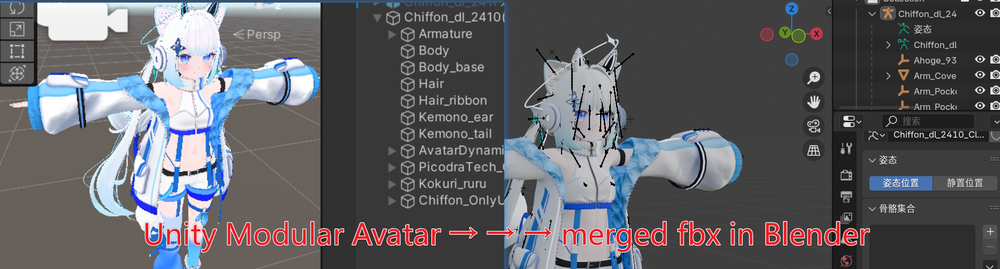

# Blender-Safe Avatar FBX Exporter



[](https://github.com/ccd775/BlenderSafeAvatarFbxExporter/actions/workflows/source-validation.yml)
[](LICENSE.md)
[](https://unity.com/releases/editor/whats-new/2022.3.22)

[简体中文（默认）](README.md)

An Editor-only Unity tool that exports a **Modular Avatar Manual Bake result** to a Blender-compatible FBX while preserving the avatar's current edited state.

The exporter is designed for baked avatar hierarchies that look correct in Unity but import incorrectly into Blender because different skinned meshes use compensated bind poses, scaled helper bones, duplicated control points, or FBX node layouts that Blender cannot represent directly.

## Companion FBX post-processing tool (in development)

We are also developing a separate repository for further optimization of exported FBX files. It is planned to **merge and consolidate skeletons and skin weights, improve UV-space utilization**, and provide other post-export optimizations. This repository remains focused on safe export from Unity; the companion tool will handle those later optimization steps.

**Repository:** *In development. A link will be added here when it becomes available.*

## Features

- Bakes the current bone transforms into a unified Blender rest pose.
- Preserves skin weights and an editable armature.
- Preserves single-frame BlendShape channels, frame deltas, and current nonzero weights.
- Preserves manually adjusted bone transforms and BlendShape values from the selected Manual Bake result.
- Normalizes scale-compensated bone hierarchies while preserving the visible pose.
- Embeds material textures into the FBX.
- Maps common diffuse, normal, emission, alpha, metallic, and smoothness semantics to standard FBX material properties.
- Preserves every Unity material texture binding as `UnityTexture_<property>` metadata, including non-standard shader properties.
- Handles generated `Texture2D`/`RenderTexture` values and textures located under `Packages/`.
- Handles NDMF NaNimation deletion bones by culling affected primitives instead of turning hidden geometry visible again.
- Works around Unity FBX Exporter 4.2.1 control-point merging that can silently corrupt BlendShapes.
- Separates a `SkinnedMeshRenderer` from its host bone when FBX's single-node-attribute rule would otherwise discard the mesh.
- Reopens and validates the saved FBX before replacing the requested output.
- Uses transactional replacement so an existing FBX is not overwritten until the new file has passed validation.
- Modifies only a temporary inactive clone; the selected avatar and its assets are not changed.

## Requirements

The initial release is intentionally pinned to the versions used by its FBX SDK compatibility adapter:

- Unity **2022.3 LTS** (verified with 2022.3.22f1)
- Unity FBX Exporter package `com.unity.formats.fbx` **4.2.1**
- Autodesk FBX SDK package `com.autodesk.fbx` **4.2.1** (installed transitively by FBX Exporter 4.2.1)
- Blender **4.2 LTS** recommended (verified with Blender 4.2.23)
- Source meshes must have **Read/Write** enabled

Modular Avatar, NDMF, VRChat SDK, and lilToon are **not compile-time dependencies**. Modular Avatar is only the workflow that produces the intended input hierarchy.

## Installation

1. In Unity, open **Window > Package Manager**.
2. Install **FBX Exporter 4.2.1** from the Unity Registry.
   - If Package Manager selects another version, add this exact entry to `Packages/manifest.json`:

     ```json
     "com.unity.formats.fbx": "4.2.1"
     ```

3. Copy this repository into your project as:

   ```text
   Assets/BlenderSafeAvatarFbxExporter
   ```

   You can also add it as a Git submodule at that path.
4. Wait for Unity to compile the Editor assembly.

## Usage

1. Use Modular Avatar's **Manual Bake** workflow.
2. Select the generated baked avatar root, not the original avatar that still contains Merge Armature components.
3. Make any final manual adjustments on the baked result:
   - rotate or move bones;
   - set BlendShape weights;
   - choose active materials/textures.
4. Open **Tools > Avatar > Blender-Safe FBX Exporter**.
   - Alternatively, right-click the selected root and choose **Avatar > Export Blender-Safe FBX...**.
5. Assign the baked avatar root.
6. Leave **Embed all material textures** enabled unless you explicitly want geometry-only material references.
7. Export the FBX and import it into Blender.

The current bone pose becomes the FBX rest pose. This tool does not export an animation clip for those edits.

## Texture behavior

The exporter embeds all material texture properties it can represent:

- Physical texture files under `Assets/` are staged from their source files.
- Texture files under `Packages/` are resolved through Unity Package Manager.
- Generated `Texture2D` and `RenderTexture` values are converted to PNG.
- Common standard channels are connected for Blender's importer.
- Other shader-specific bindings are retained as FBX custom metadata.

Blender cannot reconstruct an arbitrary Unity shader such as lilToon. Embedded images and metadata are preserved, but complex shader graphs may need to be rebuilt manually.

## Programmatic API

```csharp
using ccd775.AvatarFbxExporter;

var result = BlenderSafeAvatarFbxExporter.Export(
    manualBakeRoot,
    outputPath,
    embedAllMaterialTextures: true,
    overwriteExisting: false);
```

`overwriteExisting` defaults to `false` through the three-argument overload. The Editor UI asks for confirmation before passing `true`.

The returned `BlenderSafeFbxExportResult` includes mesh, vertex, BlendShape, texture, deletion-conversion, control-point-adjustment, pose-error, skeleton-error, and bind-pose statistics.

## Important limitations

- BlendShapes with multiple in-between frames are rejected because Blender's FBX importer cannot represent them reliably.
- All weighted bones and the optional `rootBone` must be inside the selected avatar hierarchy.
- Every skinned vertex must have finite, non-negative weights with a positive total.
- Meshes must be readable and have one bind pose per bone.
- Animation components and Unity constraints are intentionally removed from the temporary export clone.
- NDMF NaNimation conversion removes every primitive that touches a deleted vertex. The success report shows the affected vertex and primitive counts.
- A regular `SkinnedMeshRenderer` object with child objects is rejected because normalizing that renderer transform could change its children. A renderer hosted on a bone is handled automatically by splitting the mesh to a temporary child node.
- Reflected, singular, or non-TRS bone transforms cannot be converted safely and are rejected.
- The complete selected hierarchy is passed to Unity FBX Exporter; supported static meshes, cameras, and lights under that hierarchy may also be exported.
- Generated cubemaps, texture arrays, and other non-2D texture types are not converted.
- Material conversion is approximate, not a shader conversion system.
- Version 0.1.0 is tested on Windows. macOS and Linux Editor behavior has not yet been certified.

See [Documentation~/technical-notes.md](Documentation~/technical-notes.md) and [Documentation~/validation.md](Documentation~/validation.md) for implementation rationale and verification details.

## Tests

EditMode tests are included under `Tests/Editor` and cover:

- preservation of a manually rotated bone;
- preservation of a nonzero BlendShape value;
- generated texture embedding;
- saved-FBX reopen and channel validation;
- source-object immutability;
- refusal to overwrite an existing file without explicit permission.

Run them from **Window > General > Test Runner > EditMode**.

## License

The source code in this repository is licensed under the [MIT License](LICENSE.md).

Unity FBX Exporter and Autodesk FBX SDK are dependencies and are not redistributed or relicensed by this repository. See [Third Party Notices.md](Third%20Party%20Notices.md).
